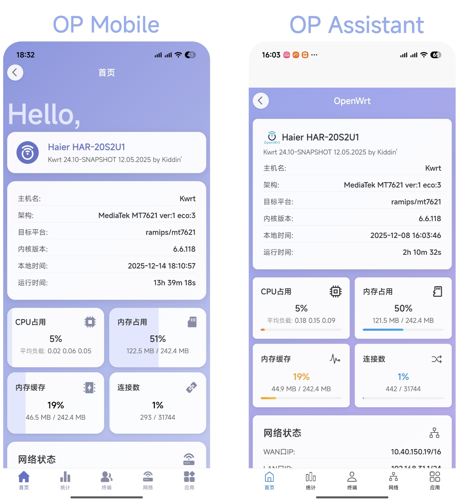

# OP Mobile

_一个OpenWRT移动端管理客户端_

  

---

## 更新日志

### v1.0.4 Release

· 增加了 Splash Screen

· 调整了关于界面

## 项目介绍

本项目基于 destan19(TT) 的开源项目： https://github.com/destan19/OPAssistant ，并针对界面进行美化。

对的，只是对界面做了调整，功能上没有任何区别（其实是因为我菜#doge）。特此感谢TT大佬的开源项目！！

该项目使用uniapp框架开发，导入HBuilderX即可编辑。

